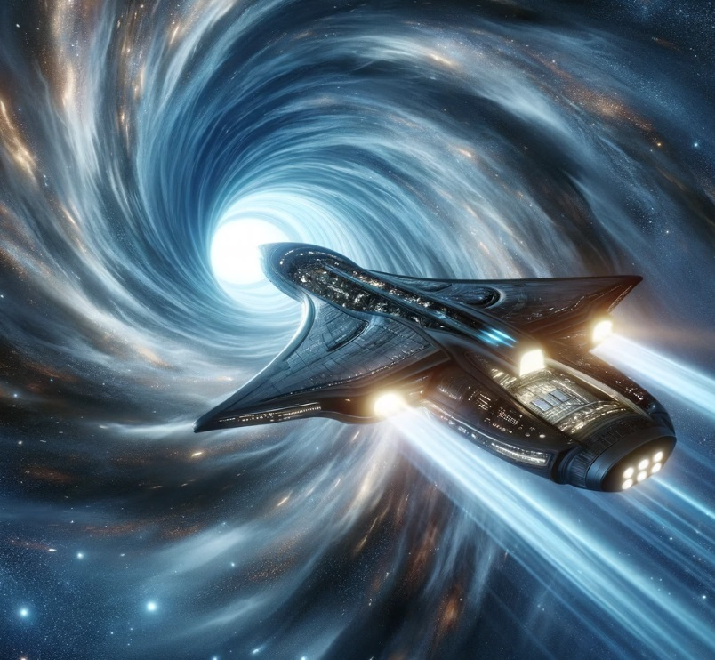

# Kaggle-Challenge

In 2912, data science skills are needed to solve a cosmic mystery involving the Spaceship Titanic, an interstellar passenger liner with 13,000 passengers. The ship collided with a spacetime anomaly, causing almost half of its passengers to be transported to an alternate dimension, similar to its predecessor 1000 years ago.

<b>Task</b>: To predict whether a passenger was transported to an alternate dimension during the Spaceship Titanic's collision with the spacetime anomaly.

<b>Training data:</b> Personal records for about two-thirds (~8700) of the passengers, are used as training data. Passenger details of the following features are given in the train.csv file.

<ul>
<li>PassengerId - A unique Id for each passenger. Each Id takes the form gggg_pp where gggg indicates a group the passenger is travelling with and pp is their number within the group. People in a group are often family members, but not always.</li>
<li>HomePlanet - The planet the passenger departed from, typically their planet of permanent residence.</li>
<li>CryoSleep - Indicates whether the passenger elected to be put into suspended animation for the duration of the voyage.</li> <li>Passengers in cryosleep are confined to their cabins.</li>
<li>Cabin - The cabin number where the passenger is staying. Takes the form deck/num/side, where side can be either P for Port or S for Starboard. </li>
<li>Destination - The planet the passenger will be debarking to.</li>
<li>Age - The age of the passenger.</li>
<li>VIP - Whether the passenger has paid for special VIP service during the voyage.</li>
RoomService, FoodCourt, ShoppingMall, Spa, VRDeck - Amount the passenger has billed at each of the Spaceship Titanic's many luxury amenities.</li>
Name - The first and last names of the passenger.
Transported - Whether the passenger was transported to another dimension. This is the target, the column you are trying to predict.
</ul>

<b>Test data:</b> Personal records for the remaining one-third (~4300) of the passengers are given in test.csv file.

<b>About the new features: </b>
<ul>
<li> We identified 6 numerical features, 7 categorical features, and one target variable. </li>
<li> We extracted new features such as Group_Travel and Travel_Members from passengerID feature. </li>
<li> Group_Travel indicates whether each passenger travelled as a group or not and Travel_Members indicates the number of members each person travelled with. </li>
<li> Then we split the Cain feature into Deck/Cabin_No and Side. Finally, we extracted Name_length from the Name feature. </li>
</ul>

<b>Feature transformations and scaling:</b><ul>
<li>The log transform was applied to remove the skewness of the below numerical features: ’RoomService’, ’FoodCourt’, ’ShoppingMall’, ’Spa’, ’VRDeck’</li>
</ul>

<b>Missing value imputation</b>: 
<ul>
<li> The mode and median were used to impute the categorical and numerical features respectively. </li>
<li> We subset the train data based on combinations of HomePlanet and Destination features to effectively use mode and median for missing value imputation for categorical and numerical features respectively.</li>
</ul>
<b>Feature encoding:</b>
<ul>
<li>All numerical features were normalised using standard scaling. All categorical features were encoded.</li>
<li>Binary encoding was used to encode the categorical features of binary in nature and one hot encoding is used for categorical features with more than two states.</li>
</ul>
Our Best Model: 
•	GBM 1 AutoML 1 20240712 214606 (A Gradient Boosting Machine model)
•	Accuracy on the Kaggle test data: 0.7994 (¬0.80)
